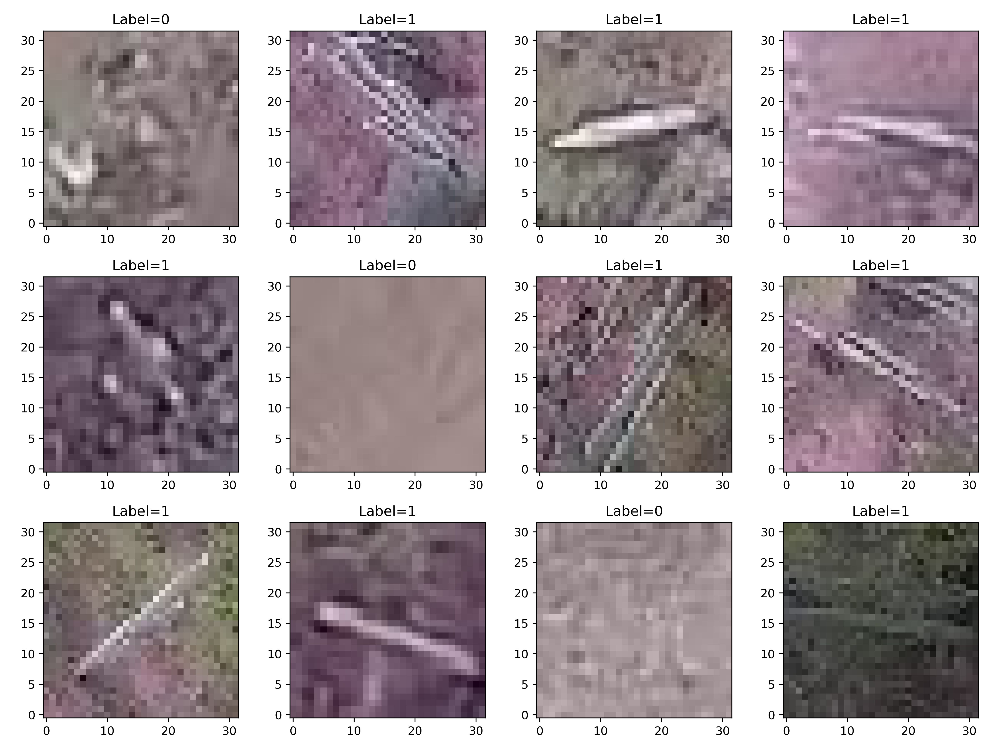

# Cactus

(I) Objective of the Project
========================================

In the dataset, some images contain cactus, but some do not. The target is to build a model to determine if a given image has a cactus in it. In the training set, there are 17.5 k color images of size 32x32. 


where label=1 means there is cactus and label=0 means there is no cactus.<br><br>

For the training and validation processes, F1 score is used as the evaluation criteria because of data imbalance between the images with and without cactus.

But for the testing on Kaggle, the submission are evaluated by the area under the ROC curve.\
(link to the Kaggle competition: https://www.kaggle.com/c/aerial-cactus-identification/overview)

(II) Structure of the Directories
========================================

```
Cactus
└── Data_Exploration.ipynb # contains more analysis of the training data we have
├── data.py # contains the functions to make data generator for each model
├── data
│   ├── test # contains all the images for testing
│   ├── train # contains all the images for training/ validation
│   ├── train.csv # has the filenames of all images in ‘train’ directory and their labels
│   └── sample_submission.csv # has the filenames of all images in ‘test’ directory
├── SimpleCNN_model # 1st model
├── Simple_model_LeNet_Kaiming_Init # 2nd model
├── ResNet18_FCL_model_Kaiming_Init # 3rd model
├── ResNet18_FCN_model_Kaiming_Init # 4th model
├── DenseNet121_FCL_model_Kaiming_Init # 5th model
├── DenseNet121_FCN_model_Kaiming_Init # 6th model
├── VGG16_FCL_model_Kaiming_Init # 7th model
├── VGG16_FCN_model_Kaiming_Init # 8th model
└── Ensemble_method
```

where sample_submission.csv in data directory is the file we need to edit by putting our predictions of labels in it.

The eight directories with *_model in their names are the different models we trained and made predictions with. ‘_Kaiming_Init’ at the end of their names means Kaiming Initialization which was initially designed for parameters initialization in ResNet with ReLU was used. But it was found that they also give better score in our task for other models, so it is also employed in other models as indicated.

The last directory ‘Ensemble_method’ is where we gathered all the predicted results from each model and made predictions by the voting of different models.

In each of the *_model directory, it has a structure like

```
│   ├── model.py # contain model structure
│   ├── train.py # contain functions for the training and validation process
│   ├── main.ipynb # main file to manage all training and prediction process
│   └── some directories named with dates 
```

in which ‘some directories named with dates’ contain the trained parameters of that date and the prediction of the trained models. 

(III) More descriptions and results of different models
========================================

\* Testing scores in the following are evaluated by Kaggle<br><br>

[1] SimpleCNN_model
----------------------------------------------------------------------

It is a simple CNN model with two blocks of Convolution/ Activation/ MaxPooling layers and three layers of fully connected layer as the head for the output classification. 

It is used to set a baseline for the F1 score for other models. 

Resulting (best) F1 score on<br> 
&emsp;Validation: 0.9796

Area under ROC curve for<br>
&emsp;Testing: 0.9445


[2] Simple_model_LeNet
----------------------------------------------------------------------

Since the task of classifying the images into two categories is relatively simple, I tried the structure of the classic simple LeNet model with ReLu being the activation function.

Also, in the observations in data exploration, it looks like the colors of the images are not really important in the classification. Extra unnecessary information would make the number of parameters unnecessarily large and even disturb the training of the model. So I also tried to do a training of the LeNet structure with the gray images. It turned out it gave similar testing score as the one with color images and there is no improvement, which implied the color in the images should not hurt the training.

Resulting (best) F1 score on<br> 
&emsp;Validation: 0.9997

Area under ROC curve for<br>
&emsp;Testing: 0.9870


[3-4] ResNet18_FCL_model and ResNet18_FCN_model
---------------------------------------------------------------------------

In these two models, the structure of ResNet18 model are used as the backbone. The FCL model uses the fully connected layers as the head for classification whereas the FCN model uses the fully convoluted network as the head. 

It was noted that the classic ResNet model is trained on the ImageNet dataset with many more labels compared with our simple task of binary classification, so its pretrained parameters could extract extra features that are not required in our task. Also the sizes of images on ImageNet are of much larger sizes of 224. The pretrained parameters might not be suitable for our much smaller images of size 32 (even if we upsample it with brute force). So it is better to train every layer of the model instead of just the classification head, which is common in other transfer learning.<br><br>


For the ResNet18_FCL_model,

Resulting (best) F1 score on<br> 
&emsp;Validation: 0.9984

Area under ROC curve for<br>
&emsp;Testing: 0.9658<br><br>


For the ResNet18_FCN_model,

Resulting (best) F1 score on<br> 
&emsp;Validation: 0.9972

Area under ROC curve for<br>
&emsp;Testing: 0.9706


[5-6] DenseNet_FCL_model and DenseNet_FCN_model
---------------------------------------------------------------------------

Similar to the ResNet models above except the DenseNet121 models are used as the backbone here.<br><br>


For the DenseNet121_FCL_model,

Resulting (best) F1 score on<br>
&emsp;Validation: 0.9982

Area under ROC curve for<br>
&emsp;Testing: 0.9748<br><br>

For the DenseNet121_FCN_model,

Resulting (best) F1 score on<br>
&emsp;Validation: 0.9972

Area under ROC curve for<br>
&emsp;Testing: 0.9745


[7-8] VGG16_FCL_model and VGG16_FCN_model
----------------------------------------------------------------------

In this model, VGG16 is used as the backbone of the model. Just as before, two different versions with different heads (FCL and FCN) are used for classification and every layer of the VGG model was made trainable here.

One thing to be noted is that since there are already 5 convolution blocks in VGG model, having the fully connected layers (FCL) as the head would make the capacity of the model so large that something uncontrollable can easily happen during backpropagation in the absent of the skip layer (compared with ResNet and DenseNet). Indeed, this happened often (even in the notebook shown in this GitHub depository) when we tested the training for different learning rate scheduler and initialization method.<br><br>

For VGG16_FCL_model,

Resulting (best) F1 score on<br>
&emsp;Validation: 0.9851

Area under ROC curve for<br>
&emsp;Testing: 0.9778<br><br>


For VGG16_FCN_model,

Resulting (best) F1 score on<br>
&emsp;Validation: 1.000

Area under ROC curve for<br> 
&emsp;Testing: 0.9728


(IV) Results of the Ensemble methods
========================================

In the ensemble method, for each image in the test set, the predictions from a few of the above models are gathered and the most popular predicted label from them are chosen to be the prediction in this method (i.e. by voting). A slight improvement can indeed be obtained in this scheme. (because in principle, different model can capture different aspect of the features)<br><br>

The combination of models giving the highest testing score involves:\
{\
'Simple_model_LeNet_Kaiming_Init',\
'SimpleCNN_model',\
'VGG16_FCL_Kaiming_Init',\
'DenseNet121_FCL_model_Kaiming_Init',\
'DenseNet121_FCN_model_Kaiming_Init',\
}<br><br>

The (Best) resulting area under ROC curve for<br> 
&emsp;Testing: 0.9903
